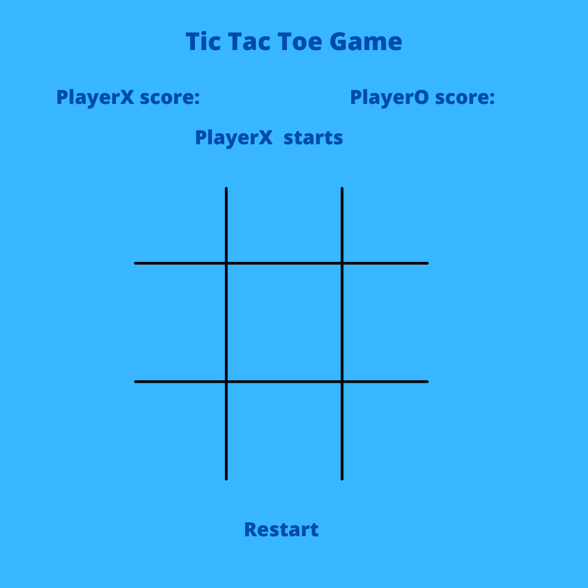

# Project: Tic Tac Toe Game
## Installation: 
No need.

## Links:
- Wireframe:

- [Game link](https://arcebald.github.io/Tic-Tac-Toe/index.html?).

## Preview

This is a game of tic tac toe, with score counters, player's next move visualization and reset button.

## Technology used:

- I used vanilla javascript, css and html.
- I used some wireframe image and click sounds.

## Approach and solving for the winner:
The main approach to the game is creating div tags in index.html page and playing in java script with the properties of the class atribute 
to capture the clicked box. Iterating through the grid cells I captured the cell and added the class property either X or O to the div tag in HTML. I checked the all winner conditions(8 total: 3 rows, 3 columns and 2 diagonals) with if-else statements. If playerX or playersO wins it will trigger the css styling to change the color of the strike.
 
## Main features:
- Text changer.
- Player's score
- Audio for the tics.
- A reset button
### User Stories

- As a user, I should be able to start a new tic tac toe game
- As a user, I should be able to click on a square to add X first and then O, and so on
- As a user, I should be shown a message after each turn for if I win, lose, tie or who's turn it is next
- As a user, I should hear a click sound when I click a square
- As a user, I should not be able to click the same square twice
- As a user, I should be shown a message when I win, lose or tie
- As a user, I should not be able to continue playing once I win, lose, or tie
- As a user, I should be able to play the game again without refreshing the page

## What's left?
- Integrating a smart AI for the second player...

